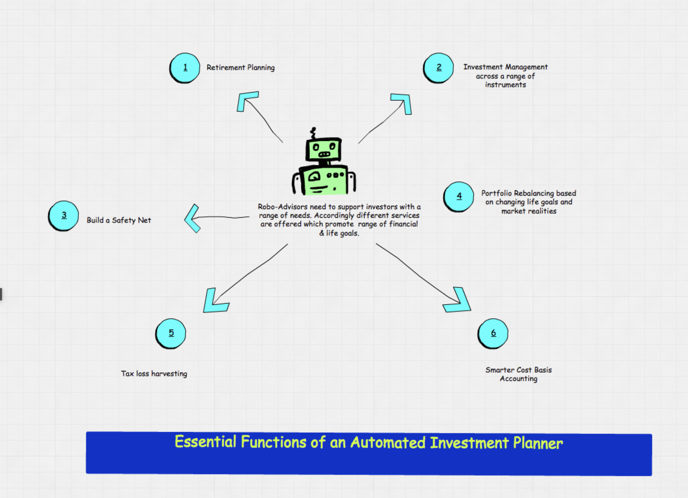

# **Columbia University Engineering, New York FinTech BootCamp** 
# **August 2022 Cohort**
## *Module 15, Challenge -  Data Science, Cloud Computing, Machine Learning, & Natural Language Processing (NLP)  -  'robo' advisor*


Objective - Utilize Amazon Web Services (AWS) Lex and Lambda services to produce a prototype 'robo' advisor. 

Scenario - Employed as a digital transformation consultant by a prominent retirement plan provider. You are tasked to increase their client portfolio with particular focus on youth engagement. 

Product -

* > AWS generated native code.
* > Lex 'bot'.
* > Lambda initialization and validation of Lex.
 

___

## **Technologies**
___
### **Dependencies**

This project leverages Jupyter Lab v3.4.4 and Python version 3.9.13 packaged by conda-forge | (main, May 27 2022, 17:01:00) with the following packages:


* [datetime](https://docs.python.org/3/library/datetime.html) - module supplies classes for manipulating dates and times.

* [relativedelta](https://dateutil.readthedocs.io/en/stable/relativedelta.html) - from dateutil, is designed to be applied to an existing datetime and can replace specific components of that datetime, or represents an interval of time.

* [json](https://docs.python.org/3/library/json.html#module-json) - JSON (JavaScript Object Notation) is a lightweight data interchange format inspired by JavaScript object literal syntax; exposes an API familiar to users of the standard library marshal and pickle modules.

* [logging](https://docs.python.org/3/howto/logging.html) - is a means of tracking events that happen when some software runs; developer adds logging calls to their code to indicate that certain events have occurred. An event is described by a descriptive message which can optionally contain variable data.

___

### **Hardware used for development**

MacBook Pro (16-inch, 2021)

    Chip Appple M1 Max
    macOS Monterey version 12.6

### **Development Software**

Homebrew 3.6.11

    Homebrew/homebrew-core (git revision 01c7234a8be; last commit 2022-11-15)
    Homebrew/homebrew-cask (git revision b177dd4992; last commit 2022-11-15)

Python Platform: macOS-13.0.1-arm64-arm-64bit

    Python version 3.9.13 packaged by conda-forge
    Scikit-Learn 1.1.3
    Tensor Flow Version: 2.10.0
    Keras Version: 2.10.0
    pandas 1.5.1

pip 22.3 from /opt/anaconda3/lib/python3.9/site-packages/pip (python 3.9)


git version 2.37.2

---
## *Installation of application (i.e. github clone)*

 In the terminal, navigate to directory where you want to install this application from the repository and enter the following command

```python
git clone git@github.com:Billie-LS/bot_da_plot_pensioning.git
```

---
## **Usage**

This is an example use of AWS.  Materials can be reviewed through github.

___

## **Project requirements**
### see starter code

---
## **Version control**

Version control can be reviewed at:

```python
https://github.com/Billie-LS/bot_da_plot_pensioning
```

[repository](https://github.com/Billie-LS/DeepL_Adventure_Angels)


___
## **Contributors**

### **Author**

Loki 'billie' Skylizard
    [LinkedIn](https://www.linkedin.com/in/l-s-6a0316244)
    [@GitHub](https://github.com/Billie-LS)


### **BootCamp lead instructor**

Vinicio De Sola
    [LinkedIn](https://www.linkedin.com/in/vinicio-desola-jr86/)
    [@GitHub](https://github.com/penpen86)


### **BootCamp teaching assistant**

Santiago Pedemonte
    [LinkedIn](https://www.linkedin.com/in/s-pedemonte/)
    [@GitHub](https://github.com/Santiago-Pedemonte)


### **askBCS assistants**

Laanu Adeyeye
    [LinkedIn]()
    [@GitHub](https://github.com/Laanu)


___

### **Images utilized**

[HeaderImage](https://www.vamsitalkstech.com/architecture/how-robo-advisors-work-23/)

[SmartInvestor](https://www.smartinvestor.com.my/robo-advisor-in-malaysia-8-robo-advisor-platforms-to-choose-from/)

[ITWorldCanada](https://www.itworldcanada.com/article/cloud-services-to-bridge-digital-divide-between-small-and-big-companies-aws-impact-report/503954)

___
### **Additional references and or resources utilized**

[Stack Overflow](https://stackoverflow.com/questions/67467874/an-error-has-occurred-the-server-encountered-an-error-processing-the-lambda-res)

___
## **License**

MIT License

Copyright (c) [2022] [Loki 'billie' Skylizard]

Permission is hereby granted, free of charge, to any person obtaining a copy
of this software and associated documentation files (the "Software"), to deal
in the Software without restriction, including without limitation the rights
to use, copy, modify, merge, publish, distribute, sublicense, and/or sell
copies of the Software, and to permit persons to whom the Software is
furnished to do so, subject to the following conditions:

The above copyright notice and this permission notice shall be included in all
copies or substantial portions of the Software.

THE SOFTWARE IS PROVIDED "AS IS", WITHOUT WARRANTY OF ANY KIND, EXPRESS OR
IMPLIED, INCLUDING BUT NOT LIMITED TO THE WARRANTIES OF MERCHANTABILITY,
FITNESS FOR A PARTICULAR PURPOSE AND NONINFRINGEMENT. IN NO EVENT SHALL THE
AUTHORS OR COPYRIGHT HOLDERS BE LIABLE FOR ANY CLAIM, DAMAGES OR OTHER
LIABILITY, WHETHER IN AN ACTION OF CONTRACT, TORT OR OTHERWISE, ARISING FROM,
OUT OF OR IN CONNECTION WITH THE SOFTWARE OR THE USE OR OTHER DEALINGS IN THE
SOFTWARE.


